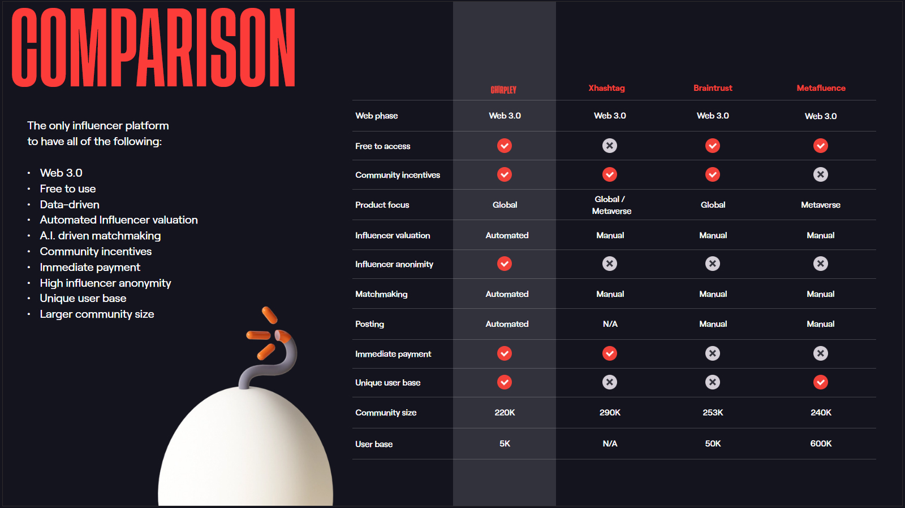

# Introduction

## Why Chirpley is changing the landscape of influencer marketing

The arrival of Chirpley, a cutting-edge new influencer platform using Artificial Intelligence, Machine Learning and Blockchain technology, was bound to happen.&#x20;

Chirpley has been set up as an automated platform that is exclusively dedicated to nano- and micro-influencers. And exactly that is where the future of influencer marketing lies, much more than with the mega-influencers with zillions of followers.

Some would call small influencer marketing a niche market, interesting for smaller brands, webshops and local businesses. Maybe it is, but with Chirpley coming onto the stage, it looks like it will be able to take this market to a level that will pretty soon leave the label 'niche' well behind.&#x20;

In the very short time it is here, the first small influencers and marketers are already subscribing in promoting numbers.&#x20;

**600% more engagement**&#x20;

Influencer marketing has always been the online extension of your knowledgeable neighbour, always there to point you in the direction of the best things to buy or to do.

Mega-influencers are way past that. They make a lot of noise but today we're at the point that everyone knows they are just telling you what their multimillion dollar sponsor contracts presecribe them to tell us.&#x20;

This is now getting stale fast. The world is moving into another direction. People are increasingly looking for people they can connect with more than just look at.&#x20;

True influencer marketing is all about credibility, engagement and trust. And this is exactly what small influencers bring into the world.&#x20;

Check this: compared to mega-influencers, the engagement level of small influencers is some 600% higher.

No wonder they are going places faster than any other influencer. The worldwide trend is very clear proof of that: the smallest influencers are experiencing the largest growth right now and they are accellerating too.&#x20;

Because sponsors, advertising people, marketers are just totally falling in love with nano- and micro influencers and their engagement in niche markets.&#x20;

### Connecting made easy&#x20;

Until now, advertisers and marketers had a hard time working with small influencers. It is way easier to hire a mega-influencer and reach 20 miliion people than work with 1000 small influencers to get the same kind of reach.&#x20;

That takes a lot of time and a lot of effort to set it up, to negotiate deals and to manage all the influencers at the same time during a campaign.&#x20;

The great thing about the new Chirpley platform is that it reduce this process to something like - are you ready for this: 5 minutes. Just 5 minutes to orchestrate a complete army of the small influencers who are getting all the trust and attention of their virtual 'familie' of followers.&#x20;

The whole idea behind Chirpley has been to create a decentralized organization that operates in the interest of its end users: the small influencer and the marketer.

Artificial intelligence, Machine Learning and Blockchain technology supply the solution to make that happen. Chirpey has succeeded in combining this cutting edge technology in a way that so far no other automated platforms have achieved.

It translates into creating precise matches between brands and small influencers, getting them the very best price in the marketplace and off they go.&#x20;

All in all this means that the problem to work with thousands of small influencers in one go is taken off the table now.

### Minimal effort, maximum result

It is very likely that this development will signify the beginning of a new era in terms of influencer marketing. Until now, investors and marketers around the world have been wondering about small influencer marketing for some time.

It is not that they didn't see the appeal of the level of trust, loyalty and engagement that small influencer bring.

It was the relative hassle of getting to find the right ones and the trouble of negotiating deals that made them shy away from getting into working with them.

A platform like Chirpley will change all that, paving the way for unlimited access to truly millions of nano- and micro influencers around the world. And vice versa: it will hand small influencers access to brands and sponsors just as easy too.

Apart from that, there is the element of education and development that adds extra value to this platform. Although Chirpley has only just started, already it has pledged to put a lot of effort into developing the skills of small influencers.

Nano-influencers (1000 followers max) and micro-influencers (1000 to 50.000 followers max) are usually people who have started out for fun, getting online to tell their friends about their passion.

As they are more spontaneous than professional in their venture, Chirpley will try and help them with the tips and tricks about things like how to improve their content, how to work with sponsors and more about online communication trends that could help them going places as an influencer.

One of the issues that is high up on their agenda is the growing trend for influencers to be more authentic.

As a topic that may seem a little fussy coming from an influencer platform, but in reality it makes a lot of sense - for the small influencers themselves but also for the marketers that woulkd want to work with.

### Authenticity rocks

The first signs are already there on Instagram: quite a few influencers are showing more and more of their authentic self than they did before.

As influencers have a sharp eye for what is happening in the marketplace - they want to keep attracting brands after all - some of them may already have picked up on the shifting interest of consumers in more authentic brands.

Over the last couple of years, there has a been growing demand for brands to show more of who they really are and what they stand for. The time of pure image building brand communication is moving towards the exit, so it seems.

Consumers are looking for more modesty, honesty and intimacy when it comes to following brands and influencers. And brands are coming round to the fact that authenticity on social media is fast becoming a necessity to build a digital community.

As a result, brands are increasingly working with small influencers who don't try to be someone else - as in: the botoxed beauty queens of influencers - but as someone who looks and sounds genuine, honest and convincing.

This general trend for more authenticity already is taking effect on influencers. We are seeing an increase in influencers using the #nofilter trend. One Instagram influencer has been known to say that 'the days of a perfectly manicured feed are slowly dying out.'

### Small influencers going places

The arrival of the Chirpley platform could well grow into something of a gamechanger, concerning the use of small influencers over the mega ones.&#x20;

As the hassle is taken out of matching up and working with small armies of nano- and micro-influencers, brands are suddenly provided with a serious opportunity to change their influencer marketing strategy.&#x20;

The cutting edge technology that is at work here does show great potential to take the influencer marketing as a whole to the next level of next level of interaction with consumers.

Seeing that the marketing world is already shifting towards more authentic and honest contact with target audiences to build trust and loyalty, the timing seems right for a platform like Chirpley to make a big splash.&#x20;

First signs are that there is already a lot of interest for the Chirpley platform, with small influencers and marketing execs already subscribing to get on board early.&#x20;

Also, Chirpley has caught the eye of the crypto-community, because of its ultra high-tec character and use of Blockchain technology, That Chirpley is planning to come out with their own token shortly only adds to the interest of crypto-investors on the lofkout for highly promoting start-ups like this.

_They could well be going places fast; something that Chirpley is putting forward in this entertaining video, the first of a number of video's that will show small influencers and marketers how to, well, going places with Chirpley._
