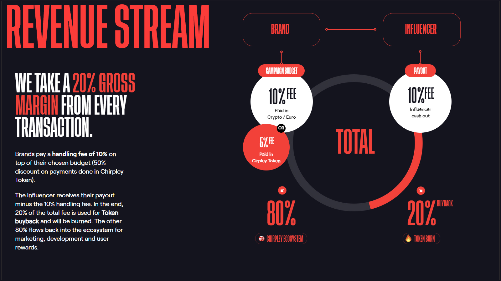

# Business Model

Chirpley offers the solution to make campaigns more streamlined and accurate at a highly economical, cost-efficient price. A market price is formed which is based on the data from the linked social media channels of the influencers.

Brands pays a handling fee of 10% taken from their chosen budget (50% discount on payments done in Chirpley Token).

The influencer receives their pay-out minus the 10% handling fee. In the end, 20% of the total fee is used for Token buyback and will be burned. The other 80% flows back into the ecosystem for marketing, development, and user rewards.

****

### **Chirpley (CHRP) Token Economy** 

Copy link\
