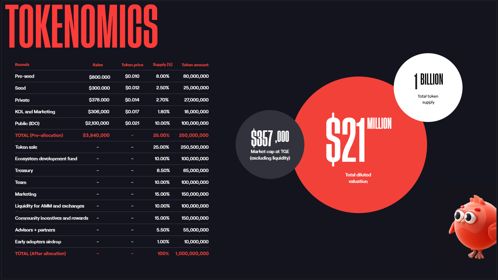

# Token

### $CHRP is the deflationary utility token in the Chirpley ecosystem.

The brand can make the payment in any currency, whether fiat or crypto. Because of the swapping mechanism in the underlying layer, any currency would be converted to $CHRP in the backend. Due to which, the influencer gets paid only in $CHRP, which increased the sustainability of the token.

20% gross margin is taken on each transaction out of which 1/5th is sent to a burn address directly.

Chirpley has set aside 15 percent of tokenomics for marketing purposes. A tiny percentage will be distributed every day and vested over a five-year period.&#x20;

Influencers will be paid in $CHRP automatically to promote the Chirpley platform and token, ensuring a steady supply of promotion for the platform and token. This will also unlock the fully automated and decentralized self-sustaining platform in the future.

Passive rewards through Staking. Influencers can choose to lock the $CHRP token for 30-60-90-120 etc. days on platform. Even in the case the token drops in value, they still get the passive rewards. Further, this creates the mechanism to hold and not panic sell, in case the value of the token drops, if ever.

Staking also gives the holders voting power when Chirpley moves onto a DAO model in the future, as the token of governance. Holders can make decisions on various releases and further rewards like NFTs etc.

### Tokenomics

### Vesting

.jpg>)
